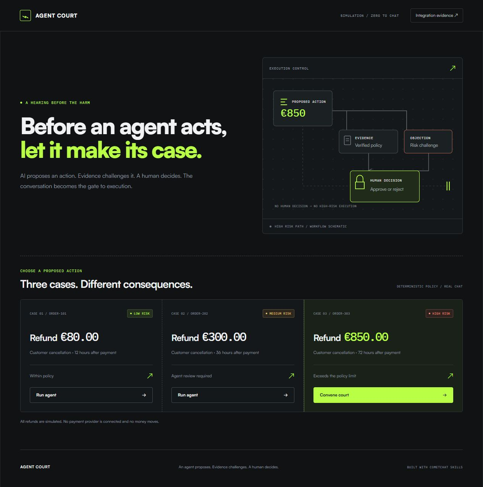

# Agent Court

Before an autonomous agent acts, it may have to defend the action.

Zero to Chat 2026 demo. Built with CometChat Skills.

Agent Court creates a live CometChat room before a risky simulated refund. Executor proposes €850, Evidence establishes a €425 policy maximum, Risk objects, and a human sends `APPROVE €425`. The server reads that exact message from CometChat before producing the €425 execution receipt. The counterfactual shows €425 of policy-violating refund prevented in this simulated case.

**Delivery status:** public build and real CometChat browser flow verified. Final competition upload has **not** been sent. All refunds are simulated; no money moves.

[Open the public demo](https://burning-stephen-contractors-really.trycloudflare.com) · [Public repository](https://github.com/chizhmansky-prog/agent-court) · [Demo video](submission/final-video.mp4) · [Contest checklist](submission/CONTEST_CHECKLIST.md)



The demo URL is temporary, with no uptime guarantee; a tunnel restart changes it. The app runs as one persistent Node process. It is a demonstration of runtime governance: the discussion determines execution, and the resulting change is measurable. Executor, Evidence and Risk use deterministic templates with verified facts.

| Simulated counterfactual | Outcome |
|---|---|
| Without the court | €850 refund; €425 above policy |
| With the court | Human approves €425; €425 above-policy amount prevented |

| Deliverable | Current status |
|---|---|
| Live CometChat integration | Verified; [Gate 0 evidence](reports/GATE0_EVIDENCE.md) |
| Public HIGH court, invalid approval, valid decision and receipt | Verified; [public provider read-back](reports/public-live-readback.json) |
| Repository tests and Linux runtime | 127 tests; [successful Linux CI](https://github.com/chizhmansky-prog/agent-court/actions/runs/37283096306), source `be724c56279461b9d5c64157eda63eaaa8d2f08e` |
| Independent synthetic audit | 29 core and 9 API probes passed; [reproduction report](reports/INDEPENDENT_CORE_AUDIT.md) |
| Dark UI screenshot | Captured above |
| Demo video | Exported: 80.021333s, 1280×960, H264/yuv420p, 30fps, AAC; [independent visual review passed](reports/MEDIA_AUDIT.md) |
| Public GitHub repository | Available at the link above |
| Public demo URL and browser smoke | PASS; [sanitized deployment receipt](reports/public-deployment-receipt.json) |
| Single-entry eligibility | HUMAN_CHECK_AT_FINAL_SEND |
| X submission URL | NOT SENT — final upload is the user's stop boundary |

The video is an **edited demo from actual production runtime captures**, not a continuous screen recording. Its Skills shot includes the actual editor and official CLI installation evidence. [Export metadata and source hashes](submission/video-verification.json) record technical verification; [independent exported-frame review](reports/MEDIA_AUDIT.md) passed.

Source code is inside **`agent-court/`**. From this package root:

```powershell
cd agent-court
npm ci
# For a new checkout only: copy .env.example to .env.local and fill its values.
npm run dev
```

Open [the local app](http://127.0.0.1:3010). See the [application README](agent-court/README.md) for credentials, the demo flow, verification, and deployment boundaries. Satoshi is downloaded unmodified from official Fontshare by the dev/build hook; its binaries are gitignored. The 25 generated CometChat Skills were used locally and are reinstalled with the documented official command in a fresh checkout.

The original requirements remain authoritative:

- [Technical specification and sequential plan](01_TZ_AND_SEQUENTIAL_PLAN.md)
- [Product logic and execution invariant](02_AGENT_COURT_LOGIC.md)
- [Integration and submission requirements](03_STACK_DEPENDENCIES_INTEGRATIONS_REGISTRATION.md)

[Completion plan](COMPLETION_PLAN.md) records the execution phases. [Pre-upload handoff](submission/PRE_UPLOAD_HANDOFF.md) collects verified results and limitations. [Tweet draft](submission/TWEET_DRAFT.md) targets the official challenge thread with the real public repository URL. [Contest checklist](submission/CONTEST_CHECKLIST.md) records conditions and the final-send boundary. No published submission is claimed.

The runtime deliberately has no database. Restart loses active run IDs, which then return HTTP 410. Capacity is 100 runs per process; completed decisions are retained to prevent replay. Stateless or multiple-instance hosting is unsupported. The public app uses the Linux CI artifact, private server credentials and an anonymous HTTPS Quick Tunnel. Docker build/run remains unverified and is not the active deployment route.
